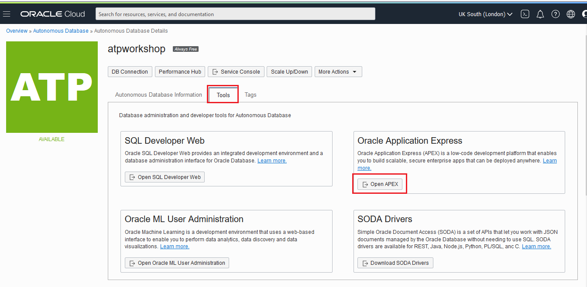
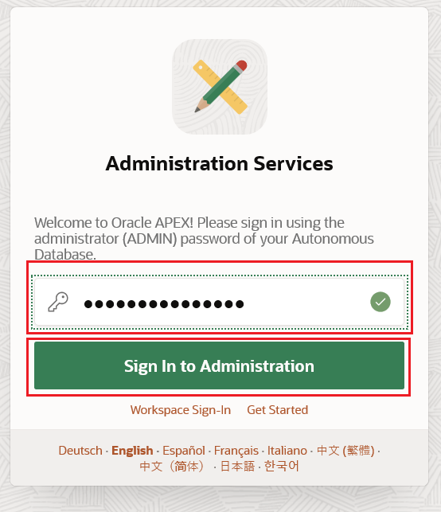
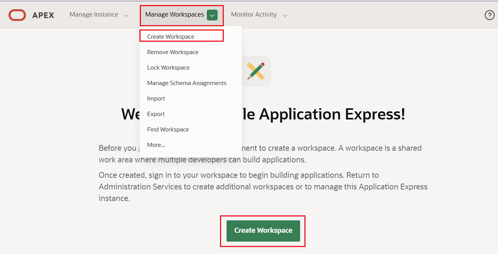
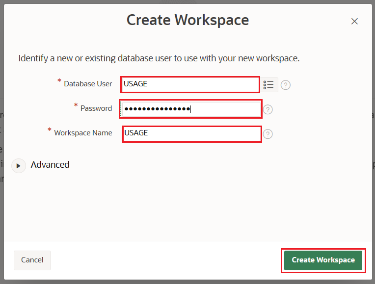
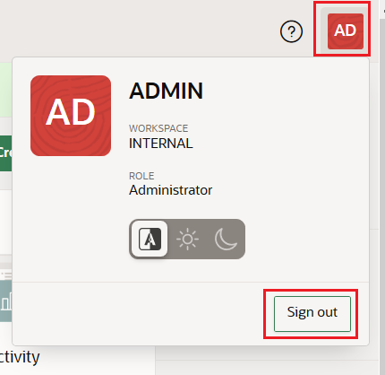
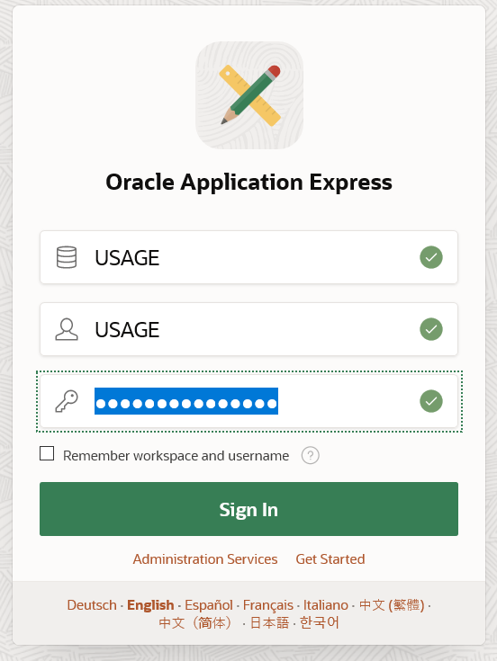
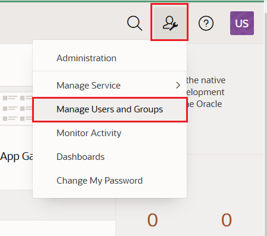
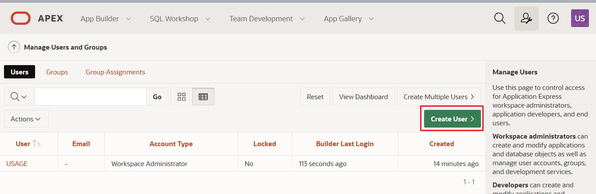
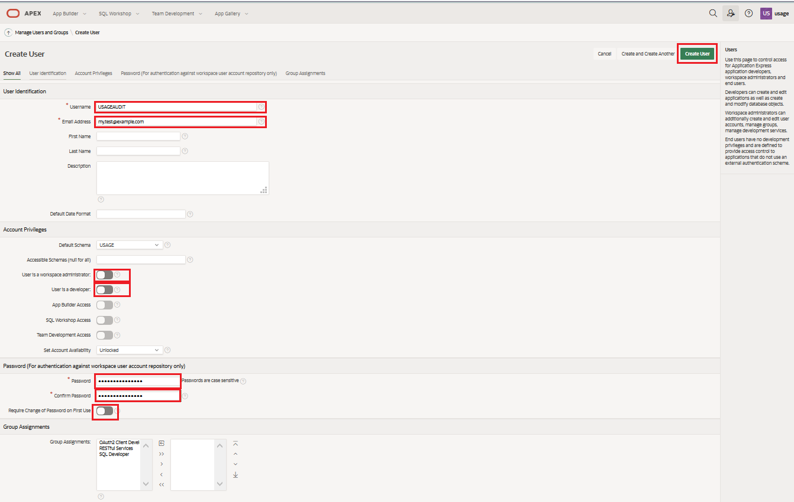

Prepare the APEX Workspace
==========================

For this lab you will create a new workspace.

From your **Autonomous Database** details page select the **Tools** tab. Select **Open APEX**.

This will open a new browser tab for Application Express Administration.

Login as the Admin user, with the Admin password you specified at Autonomous Database creation time. Select **Sign In to Administration**.

On the Welcome to *"Oracle Application Express*" page, select either **Create Workspace** in the center of the page or use the **Manage Workspaces** drop down menu and select **Create Workspace**

Use the following information to complete the form:

> **Database User:** USAGE
>
> **Password**: Enter a memorable password for your workspace that meets the requirements for Autonomous Database. 
>
> **Workspace Name:** USAGE

Then select **Create Workspace.**

You will receive a *Workspace created* message.

Logout as the Admin user by selecting the icon in the top right hand
side of the screen and selecting Sign Out.

Preparing the Environment
-------------------------

Login to APEX using:

> **Workspace name**: USAGE
>
> **User name**: USAGE
>
> **Password:** Your memorable password

Select **Sign In**

### Create an End User Account

Your application end user will login with their own account, so they do not have direct access to the underlying database or APEX application.

On the top right hand of the page there is an Administration drop down menu  with the icon of a person and a wrench.

Select this and choose **Manage Users and Groups.**

Select **Create User.**

Complete the form with the following information:

> **Username:** usageaudit
>
> **Email:** \<your email address\>
>
> **User is a workspace administrator:** Set to off
>
> **User is a developer:** Set to off
>
> **Password:**  A password that meets the requirements for Autonomous Database.
>
> **Require Change of Password on First Use:** Set to off

Select **Create User.**

## It works!

You have created your APEX workspace, and also created an end user account for the application.

## Congratulations, you are ready for the next Lab!

[**<< Go to Lab 1**](../lab100/README.md) | [Home](../README.md) | [**Go to Lab 3>>>>>**](../Lab300/README.md)