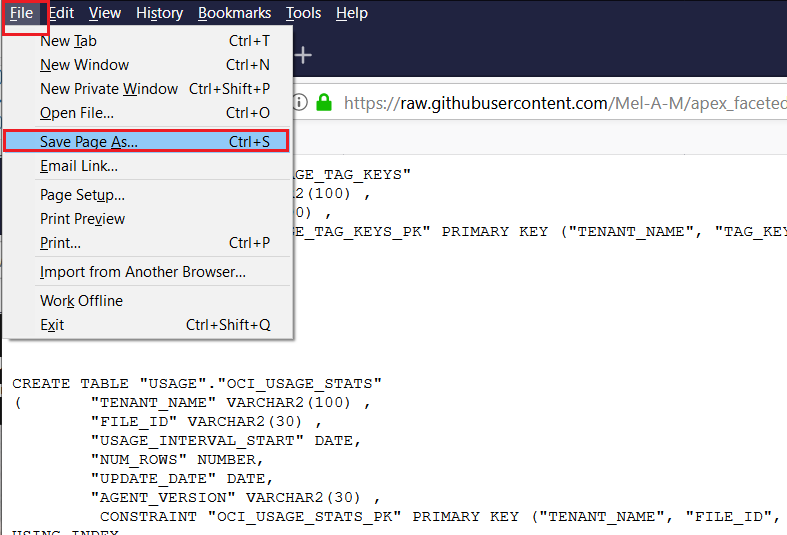
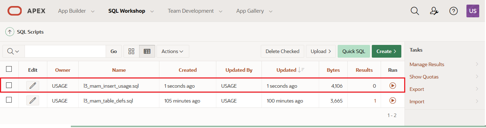

# Use REST to load data into your Application

### Create the destination tables

Download the table creation SQL script l3_mam_table_defs.sql from [**here**](../src/l3_mam_table_defs.sql)

Select the **RAW** button and this will open the script directly web browser window, without any line numbers.

Select to save the output to a file (the instructions will assume that you kept the same filename  \'l3_mam_table_defs.sql')

Return to your APEX workspace.

At the top of the Usage users Workspace home page, click the **SQL Workshop** menu and select **SQL Scripts**.

Use the **Choose File** button to select \'l3_mam_table_defs.sql' you downloaded.

{width="6.266666666666667in"
height="3.8916666666666666in"}

Select **Upload.** In the *Upload Script* dialog select the **Browse** button to select \'l3_mam_table_defs.sql\' that you downloaded.

You can examine the contents of the script by using the **Edit** (pencil) icon on the same line as your uploaded script. The script will create several tables to hold the sample data.

When you are happy with the script select **Run.**

On the *Run Script* confirmation page, select **Run Now.**

The script will run and then you are moved to a results screen. You should have the words \"Table Created\" listed in the **Feedback** column of the report. There should be **0 with Errors** . Return to the SQL Scripts page by selecting **SQL Scripts**.

Populating the Data
-------------------

The *apex_data_parser* is a PL/SQL package which provides an easy interface to parse files from various file formats, including comma-separated-values (.csv). It was introduced in APEX 19.1 and some of the features are summarised in this blog post
<https://blogs.oracle.com/apex/super-easy-csv-xlsx-json-or-xml-parsing-about-the-apex_data_parser-package>.

The parser is implemented as a table function - so the developer accesses parser results like a table. Therefore, the parser can utilize INSERT \... SELECT statements to insert rows directly into a table from the specified file.

The *apex_web_service.make_rest_request\_b* is a PL/SQL function which invokes a RESTful style Web service and returns the results in a BLOB. Utilizing this function within apex_data_parser will allow you to load data using a REST API call to a website, directly into your table.

Here is a sample usage of the package, you will run a SQL script containing similar statements to populate your database.

`insert into "USAGE"."OCI_COST_TAG_KEYS"
(TENANT_NAME,TAG_KEY)
select col001, col002
from table
( apex_data_parser.parse
(  p_content=> apex_web_service.make_rest_request_b('https://raw.githubusercontent.com/Mel-A-M/apex_faceted_search_lab/main/data/oci_cost_tag_keys.csv', 'GET')
, p_file_name=> 'oci_cost_tag_keys.csv', p_skip_rows=> 1 )
);`

This uses a REST request to GET the table data in csv format from the github website, parses the csv using apex_data_parser and then insert the data into your destination table.

Download the table insert  SQL script 'l3_mam_insert_usage.sql' from [**here**](../src/l3_mam_insert_usage.sql)

Navigate to the SQL Scripts page if you are not already there by selecting **SQL Workshop** and then **SQL Scripts.**

Select **Upload.** In the *Upload Script* dialog select the **Browse** button to select \'l3_mam_insert_usage.sql\'  that you downloaded.

You can examine the contents of the script by using the **Edit** (pencil) icon on the same line as your uploaded script. The script will use the *apex_data_parser* to populate the tables with sample data hosted in github.

Select to **Run** your script either from the *Edit* page or the *SQL
Scripts* page.

On the *Run Script* confirmation page, select **Run Now.**

The script will then be run, and it will not progress to the next screen until it completes. You can see that the script has been submitted by the page loading icon on the tab of your browser and the message "Waiting for \<your apex instance\>\"  in the footer of your page. An example using Firefox is below.

The expected run time of the script is approximately 5 minutes. When the script completes you will be moved to a results screen. You should have the row counts of the inserted rows listed in the **Feedback** column of the report. Return the SQL Scripts page by selecting **SQL Scripts**

## It works!

You have used SQL Workshop to upload SQL Scripts and execute them. 

You have used the capabilities within APEX to load data from an external web page.

## Congratulations, you are ready for the next Lab!

----------------------

[**<< Go to Lab 2**](../lab200/README.md) | [Home](../README.md) | [**Go to Lab 4 >>**](../lab400/README.md)