Import and Run the Usage Application
======================

Download the table creation SQL script 'mam_usage_apex_app.sql' from [**here**](../src/mam_usage_apex_app.sql)

At the top of the Workspace home page, click the **App Builder** menu and select **Import**.

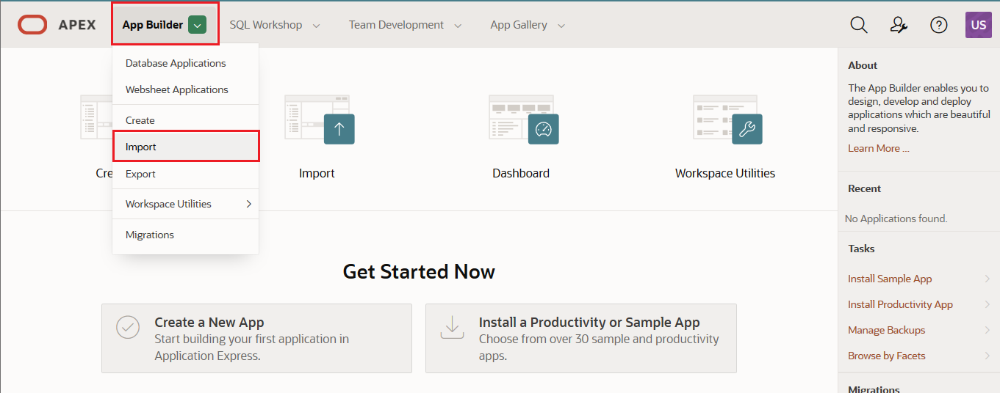

Use the **Choose File** button to select \'mam_usage_apex_app.sql\' that you downloaded. 

Set the **File Type** to *Database Application, Page or Component Export*

Select **Next**

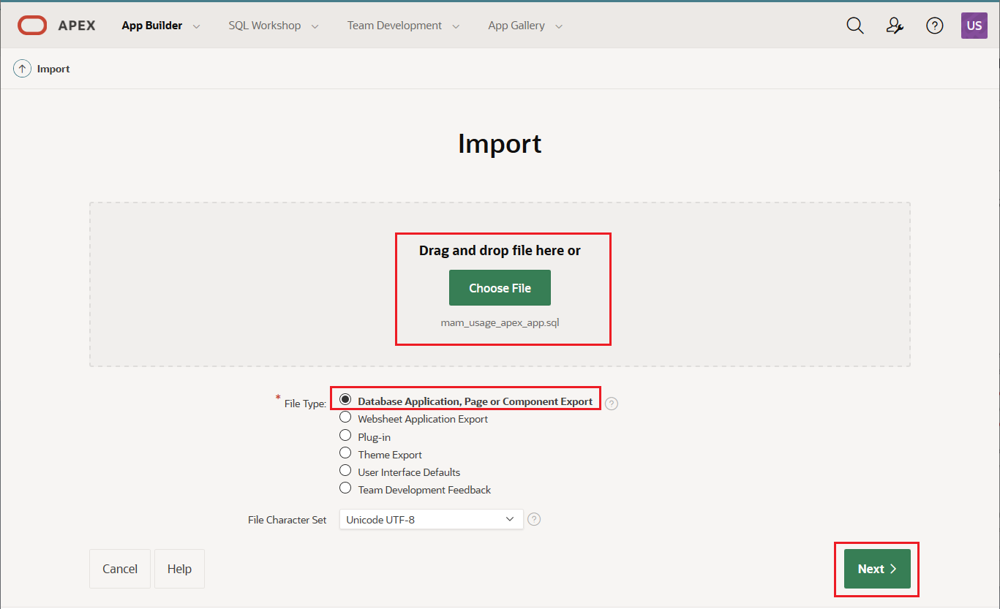

On the *\"File Import Confirmation\"* screen do not make any changes and select **Next**.

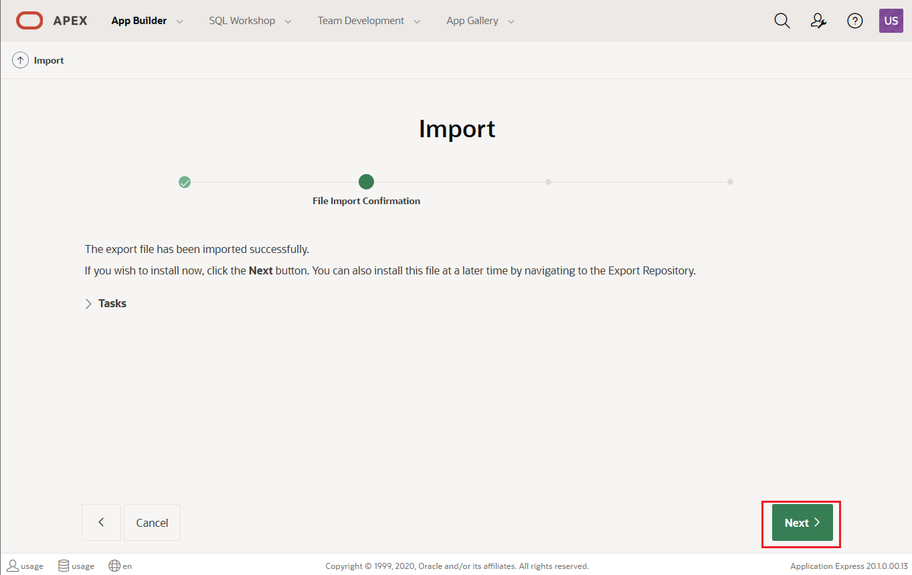

On the *\"Install Database Application\"* screen no changes are required, select **Install Application**.

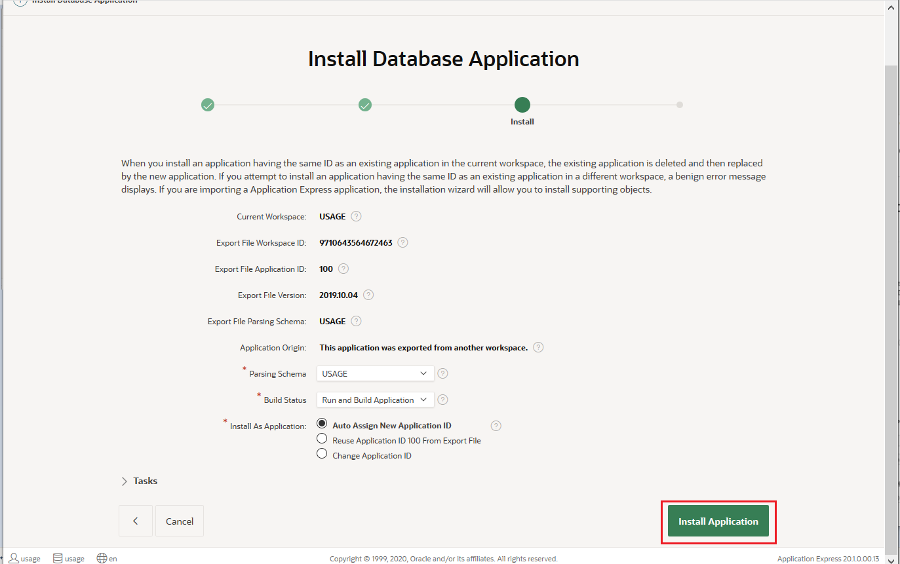


On the final screen of the wizard, select **Edit Application**.

Review the APEX Application
---------------------------

On the *App Builder* page for your new application, select **Run Application** .

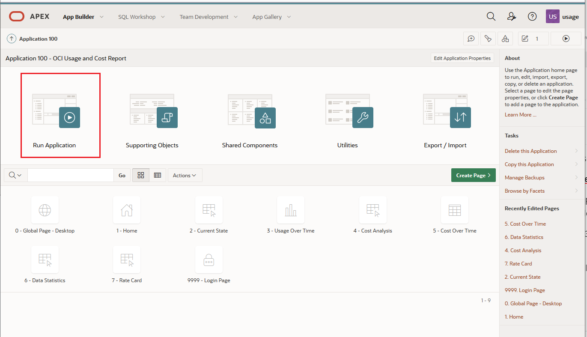

This will open the Application in a new browser tab.

If prompted, login to the application as **usageaudit** with the password you set for the user.

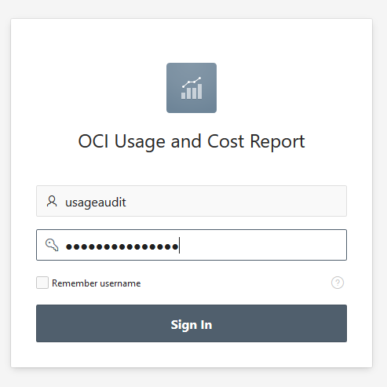

Examine the information provided by this application by selecting the *Current State* and selecting the tenancy \'apexdemo\'. Experiment with selecting different dates, different compartments.

In this demo data set you only have a fixed 13 full days of data available collected in May and June 2020, downloaded from another tenancy.

> Note: If you like this application, please follow the installation instructions that includes the process for configuring the data collection agent and using it to collect data on your tenancies.
>
> <https://github.com/oracle/oci-python-sdk/blob/master/examples/usage_reports_to_adw/step_by_step_installation.md>


Select *Data Statistics*. This page gives some information about the data in the database. 

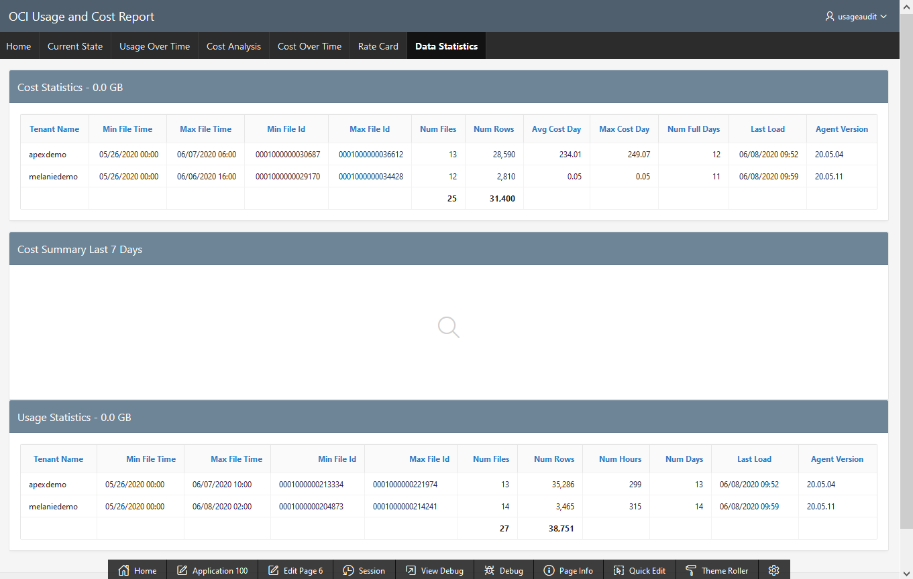

## Add a chart to the Application

Your end user has asked you to enhance this page to add some information about the number of rows loaded into the database per day.

Return to the *App Builder* page for your new application. You can return there from the application by selecting the 'Application 100' link (your application number may be different!) in the toolbar at the bottom of the screen.

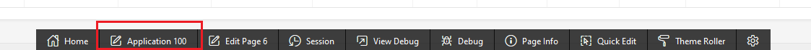


Select the **Data Statistics** page to open it for editing.

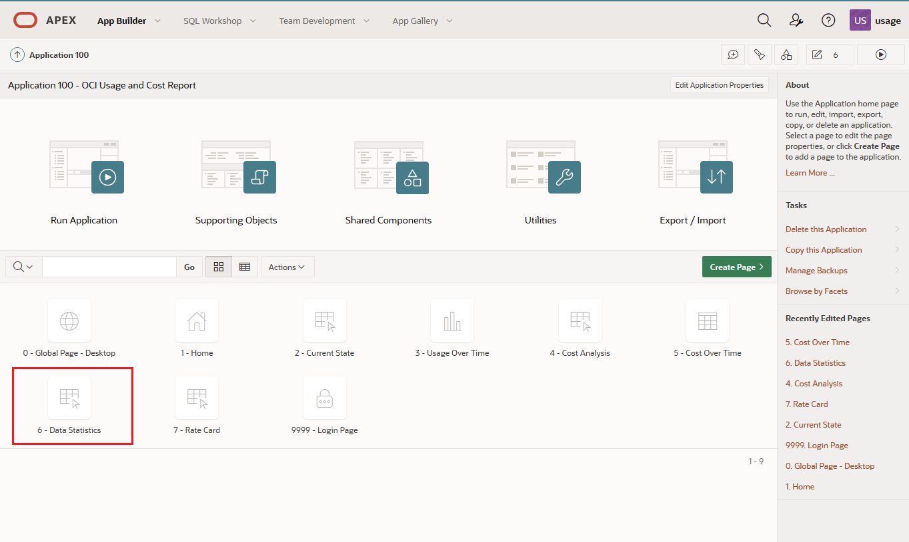

Create a new region for your Chart by selecting **Chart** in centre-bottom of your page and dragging it onto the layout region. This new chart should be placed below the existing Usage Statistics tables, but above the Footer.


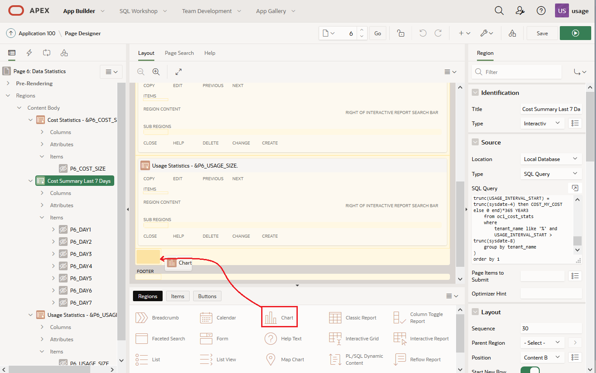

On the right hand side change the properties of your new Chart as follows:

***Identification***

​	**Title** : Data Uploaded

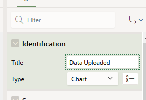

***Appearance***

​	**Template:** Standard

​	**Template Options:** Click on this and it will pop up a dialog.

​	**Accent:** Accent 15


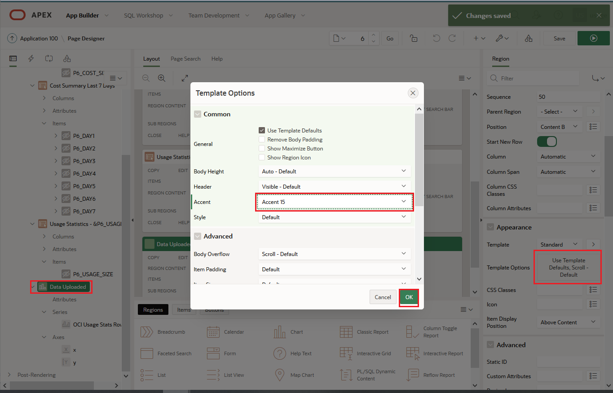

This template option selection gives our new chart the same header colours as other items on the page.


In the *Rendering* pane on the left-hand side, expand **Data Uploaded** and select **Attributes**

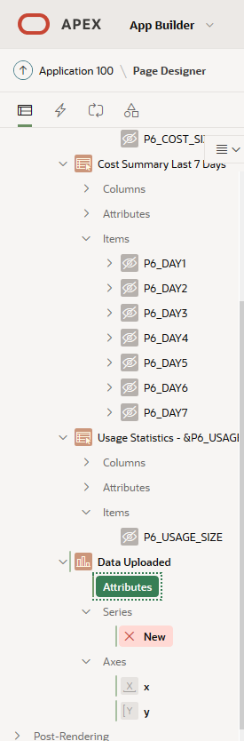

On the right hand side of the screen

Set the chart type to Bar.

*Chart*

​	**Type:** Bar


In the *Rendering* pane on the left-hand side, expand **Series** and select **New**

In the *Property* pane on the right-hand side change the following:

*Identification*

​	**Name:** OCI Usage Stats Rows

*Source*

​	**Location:** Local Database

​	**Type:** SQL Query

​	**SQL Query :** 

```sql
select trunc(us.USAGE_INTERVAL_START) FILE_DATE,
sum(us.num_rows) as us_num_rows
from usage.oci_usage_stats us group by
trunc(us.USAGE_INTERVAL_START) order by file_date;
```


*Column Mapping*

​	**Label:** FILE_DATE

​	**Value:** US_NUM_ROWS


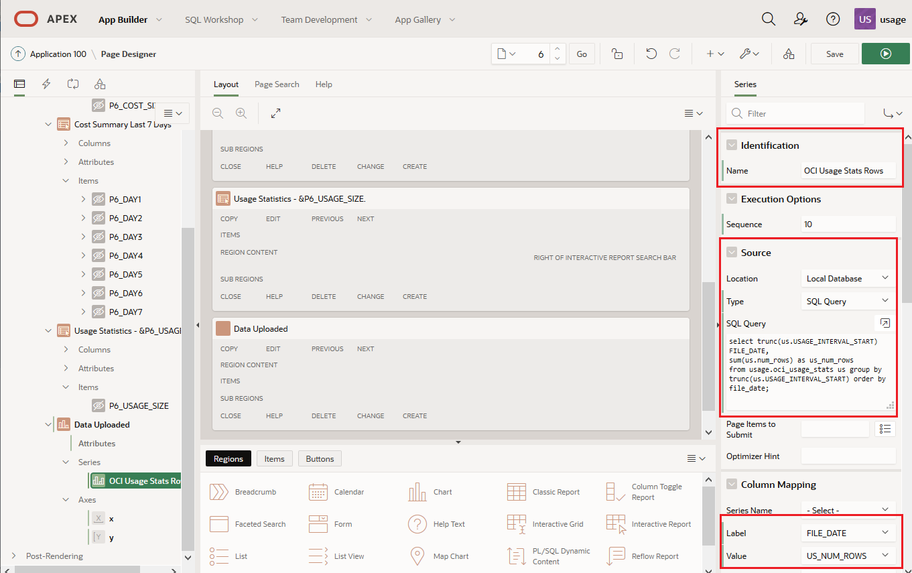

In the *Rendering* pane on the left-hand side, expand **Axes** and select **X.**

In the *Property* pane on the right-hand side change the following:

*Identification*

​	**Title:** Date Captured


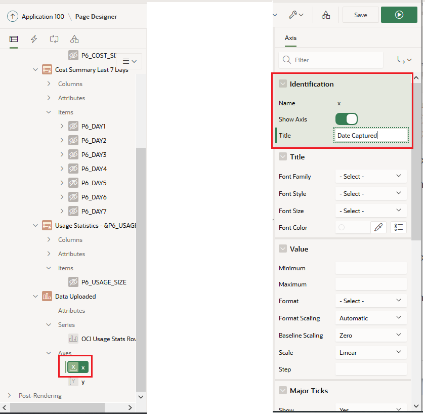

In the *Rendering* pane on the left-hand side, expand **Axes** and select **Y.**

In the *Property* pane on the right-hand side change the following:

*Identification*

​	**Title:** Number of Rows.

*Value*

​	**Format:** Decimal

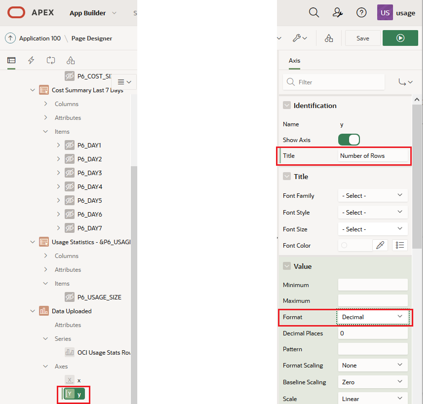


Check your changes to the chart by selecting **Save** and then **Run.**

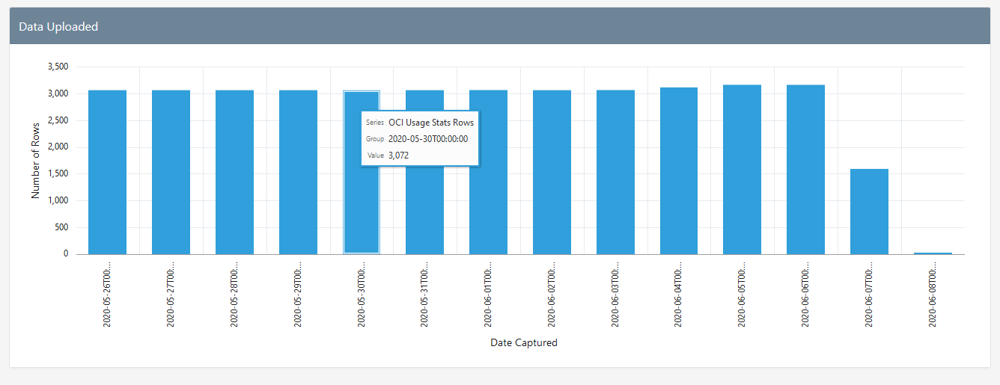

## It works!

You have imported an application into your APEX workspace.

You have used the built in charting features of APEX to enhance the application.

## Congratulations, you are ready for the next Lab!


----------------------

[**<< Go to Lab 3**](../lab300/README.md) | [Home](../README.md) | [**Go to Lab 5 >>**](../lab500/README.md)


--------------------------------------------

