Enhance your chart
============================================

The chart currently has several limitations compared to the more detailed charts on previous pages. Currently the chart shows the number of rows generated for all tenancies who have data in the database.

A different approach would be to have a select list for the list of tenancies, and then modifying the chart to use this page item to allow you to review the data for all tenancies, and to contrast data for individual tenancies.

You will use a Dynamic Action to refresh the chart whenever the tenancy in the select list is changed. A Dynamic Action defines client-side interactivity and based on a specific action such as a change in the select list, it will perform specified functions, in this case, refresh the chart region.

Return to App Builder by selecting **Edit Page 6** (your number may vary) in the Developer Toolbar at the bottom of the screen.

{width="6.258333333333334in"
height="0.36666666666666664in"}


In the Gallery (central pane, below Layout), click the **Items** tab.

Click and hold on **Select List**. Drag the item up into the Layout pane until it is in the *Items* section within *Data Uploaded* region. Once the Items section expands and the dark yellow box appears, release the mouse

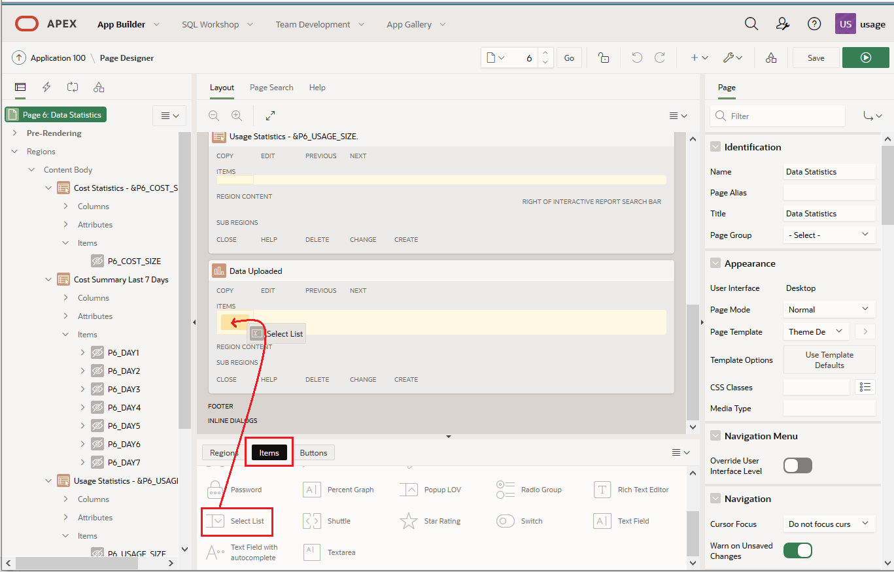


In the *Property* pane on the right-hand side change the following for your new Select List:

*Identification*

​	**Name:** P6_TENANT

*Layout*

​	**Column Span:** 2 (this limits the size of the drop down box).

*List of Values*

​	**Type:** SQL Query

​	**SQL Query:** Use the following query

```sql
select distinct tenant_name o, tenant_name r from usage.oci_usage order
by 1 ;
```


​	**Display Extra Values :** Off

​	**Display Null Values:** Off

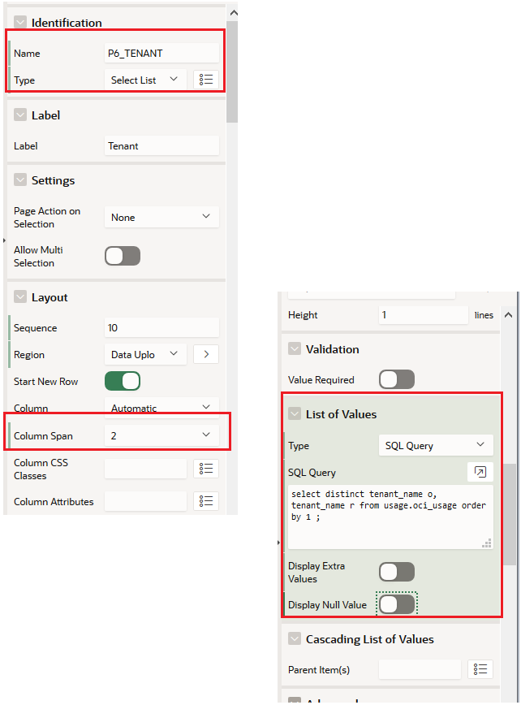


In the *Rendering* pane on the left-hand side right click on P6_TENANT and select **Create Dynamic Action.**

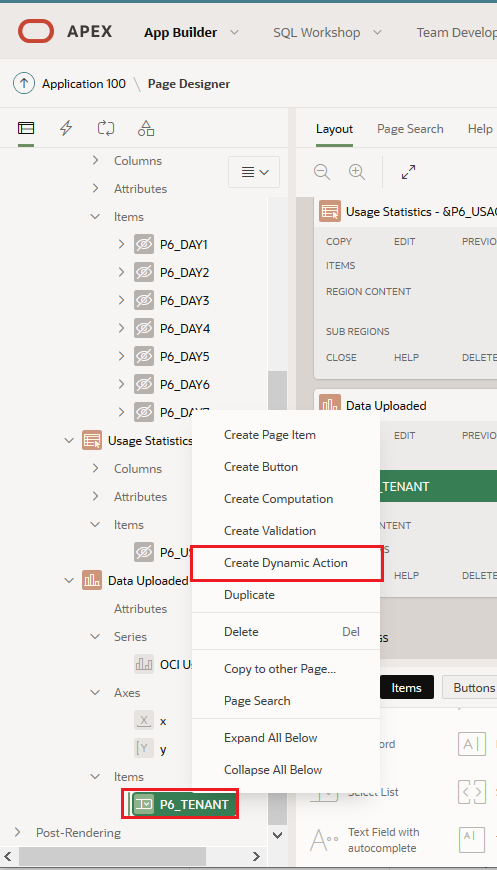


Select the 'NEW' Dynamic action 

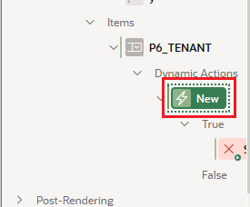

Rename it to something more meaningful by going to the right-hand *Property* editor and set the following:

*Identification*

​	**Name:** Set Tenancy

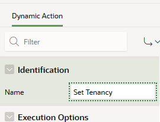

In the *Rendering* pane on the left-hand side, under P6_TENANT, *Dynamic
Actions, Set Tenancy, True* select **Show.**

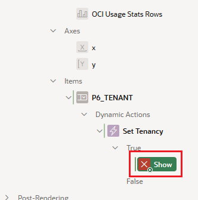


In the right-hand *Property* editor set the following:

*Identification*

​	**Action:** Refresh

*Affected Elements*

​	**Selection Type:** Region

​	**Region:** Data Uploaded (your chart)

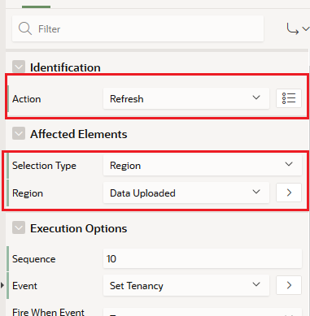

Now you will update the Chart so that it uses the new Select List value.

In the *Rendering* pane on the left-hand side, under *Content Body*,
select your **Data Uploaded** Chart.

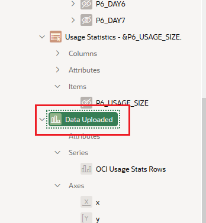


In the right-hand *Property* editor set the following:

*Source*

​	**Page Items to Submit:** P6_TENANT

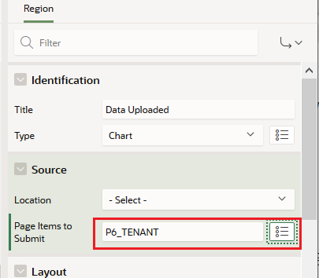

Next you will add a new series to your graph.

In the *Rendering* pane on the left-hand side, right click *Series*, and select **Create Series**

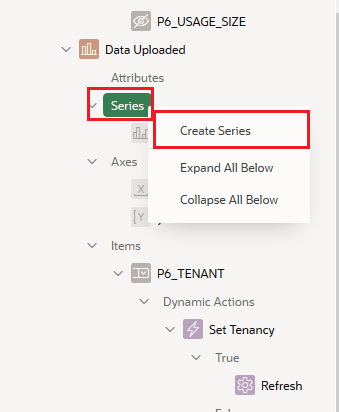

In the *Property* pane on the right-hand side change the following:

*Identification*

​	**Name:** Rows uploaded per tenancy


*Source*

​	**Location:** Local Database

​	**Type:** SQL Query

​	**SQL Query **:

```sql
Select trunc(us.USAGE_INTERVAL_START) FILE_DATE,
sum(us.num_rows) as us_num_rows
from usage.oci_usage_stats us
where us.tenant_name= :P6_TENANT group by
trunc(us.USAGE_INTERVAL_START) order by file_date;
```


*Column Mapping*

​	**Label:** FILE_DATE

​	**Value:** US_NUM_ROWS

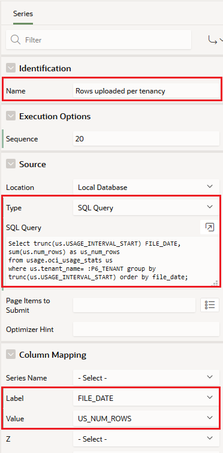


Your new chart will have 2 data series displayed. The original data series shows the Total number of rows uploaded, and the new series will show the row count for a specific tenancy.  You will need to add a *legend* to your chart to make clear which bar is which!

In the *Rendering* pane on the left-hand side, under you **Data Uploaded** chart select **Attributes**. 

In the right hand side scroll down to **Legend** and set **Show ** to on.

**Save** and then **Run** your enhanced page. 

You can now select a tenancy and the chart will refresh with the number of rows uploaded by that tenancy.

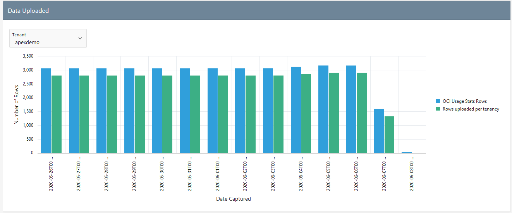

## It works!

You have enhanced your simple chart to use a list of values to change the data series.

## Congratulations, you are ready for the next Lab!


----------------------

[**<< Go to Lab 4**](../lab400/README.md) | [Home](../README.md) | [**Go to Lab 6 >>**](../lab600/README.md)