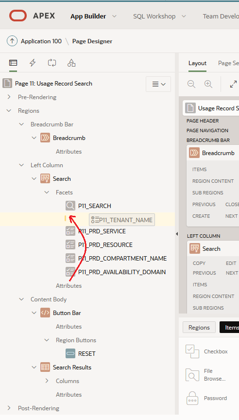
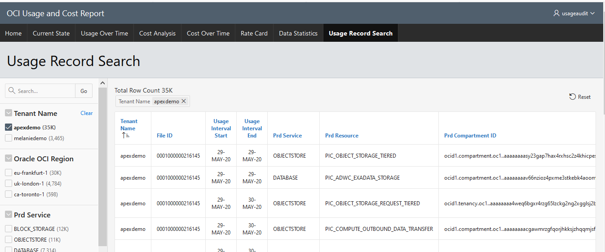

Add a Faceted Search Report to the Application
==============================================

Faceted search was a new feature in Apex 19.2. It is a feature that you have probably seen and used on shop or sales web sites. The end user can set filters using *Facets* on the left or upper side of the screen. A facet shows possible values together with the occurrence count within the result set. After the end user changes a facet, results, dependent facets and occurrence counts refresh immediately. APEX can make adding faceted search functionality to your application very simple.

You are going to add a Faceted Search page to the application, to allow searching on OCI_USAGE table.  

In *App Builder* for your application select **Create Page.**

In the *Create a Page* screen select **Report.**

This will immediately open the *Create Page* dialog. Select **Faceted Search.**

In the *Create Faceted Search -- Page Attributes* screen set the following values.

​	**Page Number:** 11 (you can leave this at the generated value, but field names in page designer will be P\<your page number\>)

​	**Page Name:** Usage Record Search

​	**Breadcrumb:** Select \'Breadcrumb\' 

​	**Parent Entry:** No parent Entry

​	**Entry Name:** Usage Record Search

Select **Next.**

In the *Create Faceted Search -- Navigation Menu* screen set the following values.

​	**Navigation Preference:** Create a new navigation menu entry

​	**New Navigation Menu Entry:** Usage Record Search

​	**Parent Navigation Menu Entry:** -No Parent Selected -

Select **Next.**

In the *Create Faceted Search -- Report Source* screen set the following values:

​	**Data Source:** Local Database

​	**Source Type:** Table

​	**Table/View Owner:** Usage

​	**Table/View Name:** OCI_USAGE

​	**Display as:** Report

The table will be analysed and suggested facets will be selected. Select the following columns to be facets.

- TENANT_NAME

- PRD_SERVICE

- PRD_RESOURCE

- PRD_COMPARTMENT_NAME

- PRD_AVAILABILITY_DOMAIN

Select **Create.**

You will now be in *Page Designer* for your new page.

Review your new page by running it.

Your new report page will be shown. Note that as part of the process there was a menu item created for your new page in the menu ribbon.

Experiment with selecting different facets.

{width="6.258333333333334in"
height="2.433333333333333in"}

While the page is usable in the current format, there are a few things
we can do to make the search flow more logical.

-   Move the tenant selector to the first facet on the navigation bar

-   Change the tenant selector from radio buttons to check boxes.

-   Replace the PRD_AVAILABILITY_DOMAIN search facet with PRD_REGION

Return to *Page Designer* for your report by selecting the **Edit Page** button in the toolbar. Your page number may be different.

{width="6.266666666666667in" height="0.325in"}

## Adjust the TENANT_NAME facet

It is very simple to change the order of the facets in the side bar. You can either drag the facet to the correct position in the left hand side, or select the facet and change the **Sequence** in the Layout section of the *Properties* panel.

In the left hand sidebar, click on the \"P11_TENANT_NAME\" facet and drag it to under \"P11_SEARCH\".

On the right-hand side of the page you will now have the properties related to your \"P11_TENANT_NAME\" facet . Edit this item as follows:

***Identification***

​	**Type:** Check Box

A \'Radio Group\' type of facet allows only one value to be selected, whereas \'Checkbox\' allows you to select multiple values. 

After reviewing the report, your users have decided that being able to narrow the search by \'PRD_AVAILABILITY_DOMAIN\' will not be used regularly, and they would prefer to be able to narrow the search using PRD_REGION.

On the left hand side right click on \'P11_PRD_AVAILABILITY_DOMAIN\' and select **Delete.**

Add a new facet to your search by right clicking on \'Facets\' and selecting \'Create Facet\'.

Select your new facet \'P11_NEW\'. On the right hand side set the following properties.

*Identification*

​	**Name:** P11_PRD_REGION

*Label*

​	**Label:** Oracle OCI Region

*Layout*

​	**Sequence:** 25

*List of Values*

​	**Type:** Distinct Values

*Source*

​	**Database Column:** PRD_REGION

Test your changes by saving and running the report.

## It works!

You have added a faceted search page to your application and learned how APEX makes this process very simple, and allows you to adjust the faceted search to meet customer requirement.

## Congratulations! 

You have completed all of the steps in this exercise.

If you want to learn more about Oracle APEX and Oracle Cloud please continue onto the 'Next Steps'.

----------------------

[**<< Go to Lab 5**](../lab500/README.md) | [Home](../README.md) | [**Go to Next Steps >>**](../next/README.md)

