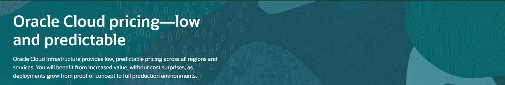
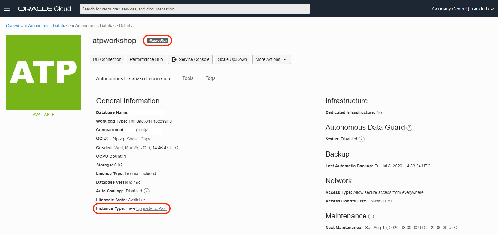
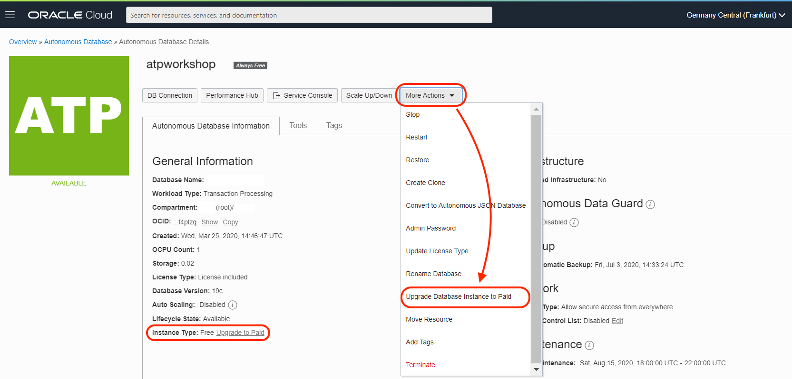
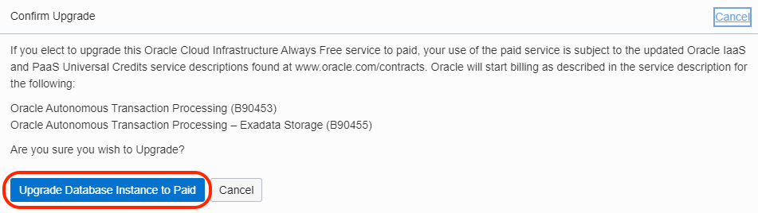
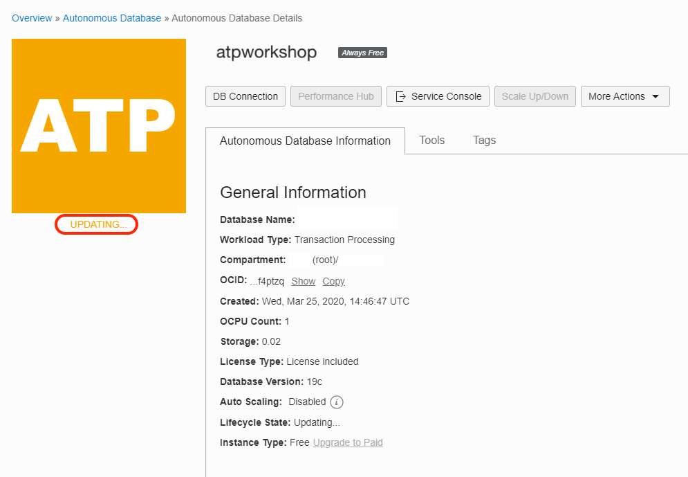
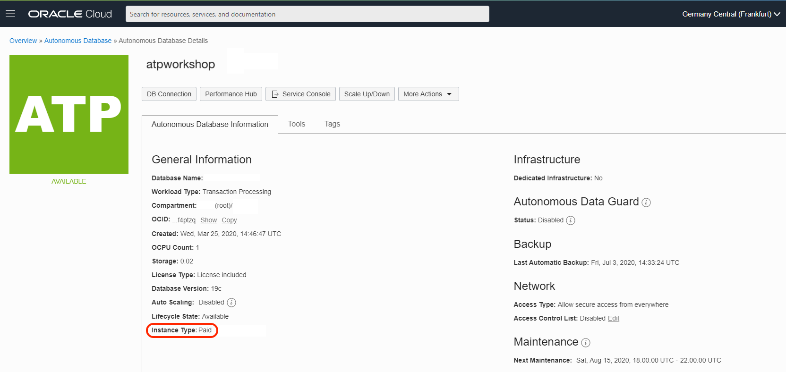
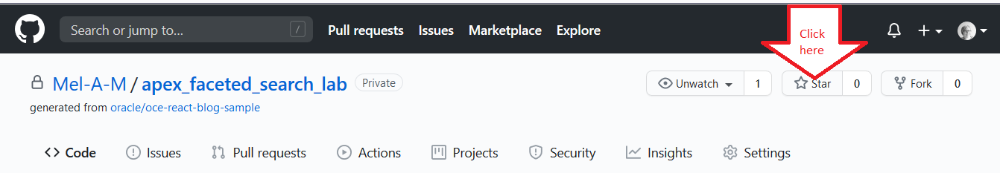

# Next Steps

- [Next Steps](#next-steps)
  - [Upgrade Instances to Paid](#upgrade-instances-to-paid)
  - [Want to learn more?](#want-to-learn-more)
  - [Troubleshooting](#troubleshooting)

## Upgrade Instances to Paid

I hope you could complete all the steps on this Oracle APEX  lab and you have learned the basic concepts from the technologies that we have used: - **Oracle Autonomous Database** - **Oracle Application Express**

The technologies that we have covered on this workshop are using **Always Free** and **Free Trial** credits so you don't have to pay for the services that you have used.

If you want to **Upgrade** the Instances that we used, you can follow these simple steps to upgrade to your favorite paid subscription model.

[Here you can see the differences models that Oracle has available.](https://www.oracle.com/ie/cloud/pricing.html)

We will show you how to Upgrade from **Always Free** instances right now.

Remember that you will see **Always Free** logo next to the name of your database as part of the database details information. You can see **Instance Type** filled out with **Free Upgrade to Paid**.

We will upgrade to Paid License in this step. You can either click on the **Instance Type** that I referred before or click on **More Actions** bottom and go to **Upgrade Database Instance to Paid**, both ways bring you to the same step.

**Confirm Upgrade** window. You can click **Upgrade Database Instance to Paid**.

After you perform this action, your database will be upgrade to **Paid** subscription. The update will take a few minutes.

You can see that **Instance Type** information has changed from **Free Upgrade to Paid** to **Paid**:

You have learned how to Upgrade your Always Free Account to a subscription model!

## Want to learn more?

If you have enjoyed the workshop, give me a star on Github: [click here! ](https://github.com/Mel-A-M/apex_faceted_search_lab)!

Please, help us to improve. [Create an issue](https://github.com/Mel-A-M/apex_faceted_search_lab/issues) if you think something is not quite right.

Learn about [Autonomous Database](https://github.com/vmleon/OracleATPGettingStarted) for developers and operators (Workshop)

## Troubleshooting

---

[**<< Go to Lab 5**](../lab5/README.md) | [Home](../README.md)

